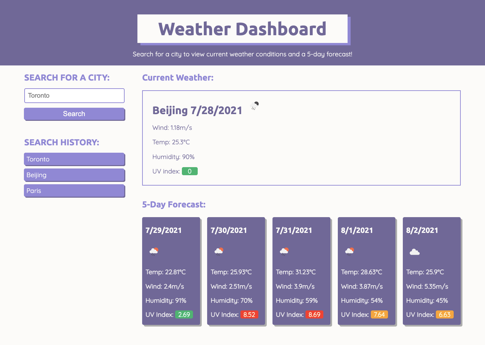

# Weather-Dashboard

## Description
This is a web application that allows users to check and see the current weather condition and weather outlook for multiple cities, so they can plan a trip accordingly. The weather data is retrieved from OpenWeatherMap using OpenWeather One Call API.

When users search for a city, they are presented with current weather condition and 5-day forecast, and that city is added to the search history and saved in LocalStorage. The current weather data contains the city name, the date, an icon representation of weather conditions, the temperature, the humidity, the wind speed, and the UV index. The 5-day forecast displays the date, an icon representation of weather conditions, the temperature, the wind speed, the humidity and the UV index. UV index is colour-coded to indicate whether the levels are low, moderate, high, very high or extreme. When users click on a city in the search history, they are again presented with current and future conditions for that city.

## Built With
* HTML
* CSS
* JavaScript
* OpenWeatherMap API
* LocalStorage
* Moment.js

## Website
https://siyanguo.github.io/Weather-Dashboard/

## Contribution
< > with ❤️  by Serena Guo

